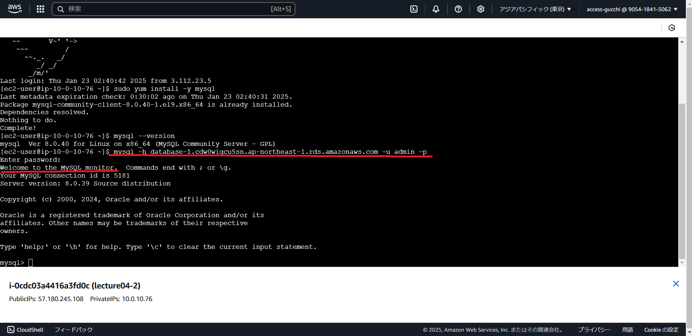

# 第4回課題

## 1.新規でVPCの作成、EC2とRDSの構築
VPCの作成はわからない単語が多かったですが録画講義を見ながらもできたので作成完了。
RDSもわりとすんなり構築できました。
EC2とRDSを接続しようともがいているときにEC2の作成時に設定を間違えていることに気づいたため作成し直しました。
その後コンソール画面から接続できましたが、課題内容と異なるため再トライ。
Cloud9を再構築してから行おうと思いましたが、方向転換しEC2でトライしました。
ました。MySQLインストール後、RDSに接続できました。
下記画像の赤線を参照ください。

## ファイルが空っぽだった理由
作成時に途中で編集ができなくなり、コマンドを打つこともできなかったので、
ページを閉じるという強硬手段を取りました。
その結果、途中で終了している状態？でスワップファイルになっており
中身が空になるということが起こりました。  
現在は復旧し、追記を書き加えています。

## 再提出後のやり直し
やり直しをして再プッシュしましたが、できていない模様…。
いったんブランチごと削除してやり直すことに。
今度はできていますように。

