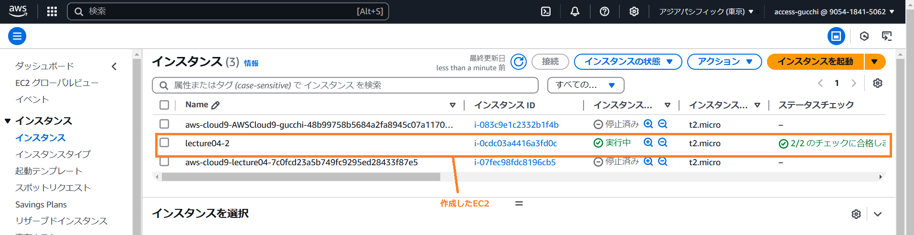
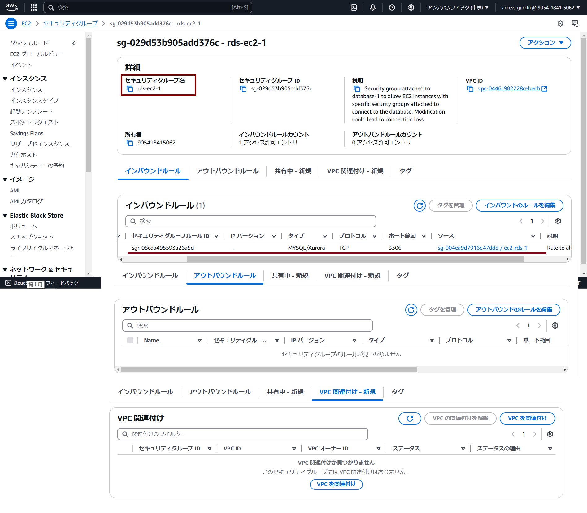

# 第4回課題

## 1.新規でVPCの作成、EC2とRDSの構築
VPCの作成はわからない単語が多かったですが録画講義を見ながらもできたので作成完了。 
RDSも動画を見ながらだったのですんなり構築できました。 
EC2とRDSを接続しようともがいているときにEC2の作成時に設定を間違えていることに気づいたため作成し直しました。 
その後コンソール画面から接続できましたが、課題内容と異なるため再トライ。 
Cloud9を再構築してから行おうと思いましたが、方向転換しEC2でトライしました。 
MySQLインストール後、RDSに接続できました。下記画像の赤線を参照ください。

## ファイルが空っぽだった理由(2025/01/24)
作成時に途中で編集ができなくなり、コマンドを打つこともできなかったので、
ページを閉じるという強硬手段を取りました。 
その結果、途中で終了している状態？でスワップファイルになっており
中身が空になるということが起こりました。  
現在は復旧し、追記を書き加えています。

## 再提出後のやり直し(2025/01/24)
やり直しをして再プッシュしましたが、できていない模様…。 
いったんブランチごと削除してやり直すことに。
今度はできていますように。

## エビデンスの再提出(2025/01/25)
以下、構築物ごとに羅列します。

2. VPC
3. EC2
4. RDS

## 2.VPCの作成
VPC作成中の画面をスクショし忘れたため、コンソール画面のスクショです。

### VPCのリソースマップ(2025/01/27)

### サブネットグループ詳細画面
ap-northeast-1a-public

ap-northeast-1a-private

ap-northeast-1c-public

ap-northeast-1c-private

## 3.EC2の作成
EC2の画面をスクショしました。作成時のものとコンソール画面です。 
使用したVPCは上記で設定したものです。 
セキュリティグループは新規で作成しました。

作成したEC2と2詳細画面です。

作成したセキュリティグループ・EC2

セキュリティグループ・EC2インスタンスへアタッチ

  
## 4.RDSの作成
RDSを作成中の画面をスクショしました。
またコンソール画面も乗せます。

### セキュリティグループの作成
database-1へアタッチ

	
認識している構成を図にしてみました

